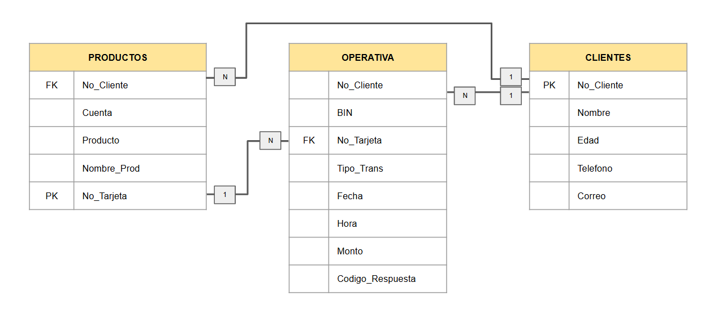

# Problema 2

Desarrolla un Datamart anexando los scripts que emplearías y responde las siguientes preguntas:

## I. ¿Qué es un Datamart explicado en tus palabras? Describe detalladamente cómo un Datamart difiere de un Data Warehouse y da ejemplos de casos de uso específicos para un Datamart considerando como ejemplo, un banco.

Un Datamart es un extracto específico de una Data Warehouse; se usan para atender necesidades específicas de análisis para una área específica dentro de la organización, por ejemplo, en el caso bancario, si tomamos el área Emisor, la Datamart de esta área incluiría únicamente la información detallada sobre las transacciones realizadas por los tarjetahabientes de débito y crédito.

La diferencias que existen entre una Datamart y un Data Warehouse es la información que contienen; una Data Warehouse almacena los datos centralizados de toda la organización, incluyendo múltiples áreas como emisor, adquirente, productos, créditos, inversiones, etc. También se diferencian con el tamaño y complejidad, al ser una Data Warehouse la base de datos centralizada es más grande y compleja, puede incluir múltiples tablas y enlaces, en cambio la Datamart es más pequeña, sencilla y dirigida a necesidades específicas para el análisis.

Como ejemplos de un Datamart podemos tomar:
- Área de Emisor: Analiza las transacciones de los tarjetahabientes para identificar patrones de gasto, detectar fraudes o segmentación de clientes.
- Área de Préstamos: Muestra datos sobre historial de créditos, tasas de interés aplicadas y clientes en riesgo de morosidad.
- Área de Marketing: Incluiría información sobre campañas e impacto en la adquisición de nuevos clientes.
    
## II. Desarrolla las tablas del Datamart considerando las siguientes Dimensiones/Catálogos y construyéndose en base a la información que crees estas pudieran contener, además debes incluir un diagrama ERD mostrando las relaciones entre todas las tablas.

Retomando el ejemplo anterior veremos la operativa Emisor, esta se compone por:
- ***Clientes:*** Los clientes se encuentran relacionados a un número de cuenta, la cual puede estar relacionado a una o varias tarjetas bancarias.
- ***Productos:*** Vienen siendo los productos Débito o Crédito y cuales tiene aperturados el cliente donde puede tener diferentes tipos de cuentas como Nómina, Cheques, Oro, Platinum, Personas Morales, entre otros.
- ***Operativa:*** Es tal cual la transaccionalidad del cliente en diversos comercios, tranferencias, ingresos monetarios, etc.
        
Considerando estos criterios construimos las siguientes tablas y relaciones.
        
**Tablas:**

1. Productos

    | Nombre de Columna | Tipo de dato y dimensiones  | Descripción |
    | :---------------- | :------------:| :---------- |
    | No_Cliente | CHAR(10)  | Valor númerico único para identificar al cliente |
    | Cuenta | CHAR(10) | Numero de cuenta relaccionadas a cada cliente (valor único) |
    | Producto  | VARCHAR(10)  | Contiene el valor de Débito o Crédito |
    | Nombre_Prod | VARCHAR(50) | Nombre del producto |
    | No_Tarjeta | CHAR(16) | Numero de tarjeta o tarjetas relacionado a cada cuenta (valor único) |
    

2. Clientes

    | Nombre de Columna | Tipo de dato  | Descripción |
    | :---------------- | :------------:| :---------- |
    | No_Cliente | CHAR(10)  | Valor númerico único para identificar al cliente |
    | Nombre | VARCHAR(100) | Nombre del cliente |
    | Edad | INT | Edad del cliente |
    | Telefono | VARCHAR(15) | Telefono del cliente |
    | Correo | 	NVARCHAR(100) | Correo del cliete |

3. Operativa

    | Nombre de Columna | Tipo de dato  | Descripción |
    | :---------------- | :------------:| :---------- |
    | No_Cliente  | INT | Valor númerico único para identificar al cliente |
    | Bin | INT (CHECK LEN=6) | Valor númerico de 6 caracteres |
    | No_Tarjeta | CHAR(16) | Numero de tarjeta o tarjetas relacionado a cada cliente |
    | Tipo_Trans | CHAR(2) | Identificadores de cada tipo de trx, como deposito, compra, etc |
    | Fecha | DATE | Dia en el que realiza la trx el cliente |
    | Hora | TIME(3) | Fecha de realizacion de la operacion |
    | Monto | DECIMAL(18,2) | Monto de la transaccion |
    | Codigo_Respuesta | CHAR(3) | Respuesta de la trx, si fue aprobada o rechazada por x motivo |

Diagrama ERD

## III. Describe las relaciones entre las tablas especificando el tipo de relación y justificando por qué ese tipo de relación es adecuado para cada par de tablas. Incluye también la explicación de cómo estas relaciones ayudan a satisfacer necesidades específicas y de ser posible ¿Plantearías una relación que facilitara la conexión entre tablas?

Tomando la imagen 1 como referencia, tenemos las siguientes llaves:
- efrio

4. Identifica las llaves primarias y foráneas de cada tabla explicando lo siguiente:
    - El razonamiento detrás de la selección de éstas llaves.

    - Cómo manejarías las situaciones de datos faltantes o inconsistentes en estas llaves.

5. Establece controles para alimentar las tablas asegurando información correcta, íntegra, precisa y confiable. Para cada tabla,sigue las instrucciones siguientes:
    - Describe las validaciones específicas que le harías a los datos.

    - Describe cómo regularías que éstas validaciones se lleven a cabo.

    - ¿Qué estrategias propones para evitar la pérdida de datos?

6. Desarrolla un análisis para determinar los riesgos posibles utilizando un lenguaje de programación.

7. Describe las características que debe tener un archivo de texto para ser importado en la base de datos y cómo automatizarias éste proceso.

8. Realiza validaciones en un lenguaje de programación que cumplan con los criterios que estableciste.