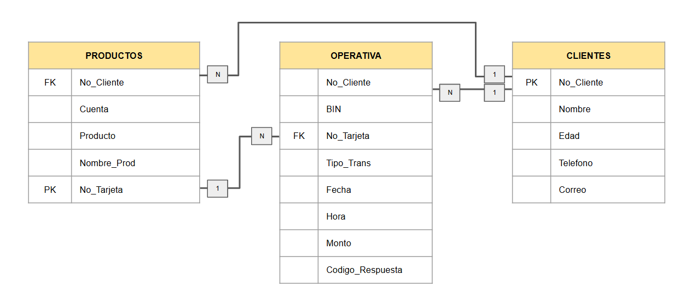

# Problema 2

Desarrolla un Datamart anexando los scripts que emplearías y responde las siguientes preguntas:

### I. ¿Qué es un Datamart explicado en tus palabras? Describe detalladamente cómo un Datamart difiere de un Data Warehouse y da ejemplos de casos de uso específicos para un Datamart considerando como ejemplo, un banco.

Un Datamart es un extracto específico de una Data Warehouse; se usan para atender necesidades específicas de análisis para una área específica dentro de la organización, por ejemplo, en el caso bancario, si tomamos el área Emisor, la Datamart de esta área incluiría únicamente la información detallada sobre las transacciones realizadas por los tarjetahabientes de débito y crédito.

La diferencias que existen entre una Datamart y un Data Warehouse es la información que contienen; una Data Warehouse almacena los datos centralizados de toda la organización, incluyendo múltiples áreas como emisor, adquirente, productos, créditos, inversiones, etc. También se diferencian con el tamaño y complejidad, al ser una Data Warehouse la base de datos centralizada es más grande y compleja, puede incluir múltiples tablas y enlaces, en cambio la Datamart es más pequeña, sencilla y dirigida a necesidades específicas para el análisis.

Como ejemplos de un Datamart podemos tomar:
- Área de Emisor: Analiza las transacciones de los tarjetahabientes para identificar patrones de gasto, detectar fraudes o segmentación de clientes.
- Área de Préstamos: Muestra datos sobre historial de créditos, tasas de interés aplicadas y clientes en riesgo de morosidad.
- Área de Marketing: Incluiría información sobre campañas e impacto en la adquisición de nuevos clientes.
    
### II. Desarrolla las tablas del Datamart considerando las siguientes Dimensiones/Catálogos y construyéndose en base a la información que crees estas pudieran contener, además debes incluir un diagrama ERD mostrando las relaciones entre todas las tablas.

Retomando el ejemplo anterior veremos la operativa Emisor, esta se compone por:
- ***Clientes:*** Los clientes se encuentran relacionados a un número de cuenta, la cual puede estar relacionado a una o varias tarjetas bancarias.
- ***Productos:*** Vienen siendo los productos Débito o Crédito y cuales tiene aperturados el cliente donde puede tener diferentes tipos de cuentas como Nómina, Cheques, Oro, Platinum, Personas Morales, entre otros.
- ***Operativa:*** Es tal cual la transaccionalidad del cliente en diversos comercios, tranferencias, ingresos monetarios, etc.
        
Considerando estos criterios construimos las siguientes tablas y relaciones.
        
**Tablas:**

1. Productos

    | Nombre de Columna | Tipo de dato y dimensiones  | Descripción |
    | :---------------- | :------------:| :---------- |
    | No_Cliente | CHAR(10)  | Valor númerico único para identificar al cliente |
    | Cuenta | CHAR(10) | Numero de cuenta relaccionadas a cada cliente (valor único) |
    | Producto  | VARCHAR(10)  | Contiene el valor de Débito o Crédito |
    | Nombre_Prod | VARCHAR(50) | Nombre del producto |
    | No_Tarjeta | CHAR(16) | Numero de tarjeta o tarjetas relacionado a cada cuenta (valor único) |
    

2. Clientes

    | Nombre de Columna | Tipo de dato  | Descripción |
    | :---------------- | :------------:| :---------- |
    | No_Cliente | CHAR(10)  | Valor númerico único para identificar al cliente |
    | Nombre | VARCHAR(100) | Nombre del cliente |
    | Edad | INT | Edad del cliente |
    | Telefono | VARCHAR(15) | Telefono del cliente |
    | Correo | 	NVARCHAR(100) | Correo del cliete |

3. Operativa

    | Nombre de Columna | Tipo de dato  | Descripción |
    | :---------------- | :------------:| :---------- |
    | No_Cliente  | INT | Valor númerico único para identificar al cliente |
    | Bin | INT (CHECK LEN=6) | Valor númerico de 6 caracteres |
    | No_Tarjeta | CHAR(16) | Numero de tarjeta o tarjetas relacionado a cada cliente |
    | Tipo_Trans | CHAR(2) | Identificadores de cada tipo de trx, como deposito, compra, etc |
    | Fecha | DATE | Dia en el que realiza la trx el cliente |
    | Hora | TIME(3) | Fecha de realizacion de la operacion |
    | Monto | DECIMAL(18,2) | Monto de la transaccion |
    | Codigo_Respuesta | CHAR(3) | Respuesta de la trx, si fue aprobada o rechazada por x motivo |

Diagrama ERD


### III. Describe las relaciones entre las tablas especificando el tipo de relación y justificando por qué ese tipo de relación es adecuado para cada par de tablas. Incluye también la explicación de cómo estas relaciones ayudan a satisfacer necesidades específicas y de ser posible ¿Plantearías una relación que facilitara la conexión entre tablas?

Tomando la imagen anterior como referencia, tenemos las siguientes llaves:

1. **Relación entre las tablas Clientes y Productos (1:N - Uno a Muchos)**

    Cada cliente puede tener múltiples cuentas y productos asociados, pero cada producto o cuenta pertenece únicamente a un cliente, esto ayuda a identificar claramente a qué cliente pertenece cada producto. Esta relación nos ayuda a identificar facilmente cuantos productos y cuales maneja cada cliente, tambien saber cuales son los productos mas contratados y detalles de las cuentas por cliente.

2. **Relación entre las tablas Productos y Operativa (1:N - Uno a Muchos)**
    
    Cada producto puede generar múltiples transacciones, pero cada transacción está asociada a un único producto o tarjeta; esto permite que cada operación  esté vinculada a un producto financiero, como una tarjeta de crédito o una cuenta de cheques. Este vínculo asegura que el historial de transacciones sea trazable al producto correspondiente. Esto nos ayuda a poder rastrear la actividad transaccional de cada cliente, para identificar patrones de fraude, generar estados de cuenta, entre otros beneficios.

3. **Relación entre las tablas Clientes y Operativa (1:N - Uno a Muchos)**
    
    Esta relación asegura que cada transacción realizada esté vinculada a un cliente a través de los productos asociados a ese cliente; ayudando a facilitar el seguimiento de los clientes para buscar patrones de lavado de dinero u otros patrones anomales.

Podriamos crea una tabla llamada **Estatus** la cual nos muestre los estatus de los plasticos o cuentas, ya que no todas las tarjetas se encuentran activas; la estructura sería de la sig. manera:

| Nombre de Columna | Tipo de dato  | Descripción |
| :---------------- | :------------:| :---------- |
| No_Cliente | CHAR(10)  | Valor númerico único para identificar al cliente |
| Cuenta | CHAR(10) | Numero de cuenta relaccionadas a cada cliente (valor único) |
| No_Tarjeta | CHAR(16) | Numero de tarjeta o tarjetas relacionado a cada cuenta (valor único) |
| Estado | VARCHAR(20) | Indica si la tarjeta está activa, cancelada, bloqueada,  etc. |


### IV. Identifica las llaves primarias y foráneas de cada tabla explicando el razonamiento detrás de la selección de éstas llaves y cómo manejarías las situaciones de datos faltantes o inconsistentes en estas llaves.

La llaves estan dadas de alta de la sig. manera:
1. **Relación entre las tablas Clientes y Productos (1:N - Uno a Muchos)**
    - No_Cliente es la clave primaria en la tabla Clientes.
    - No_Cliente es una clave foránea en la tabla Productos.

2. **Relación entre las tablas Productos y Operativa (1:N - Uno a Muchos)**
    - No_Tarjeta es clave primaria en la tabla Productos.
    - No_Tarjeta es clave foránea en la tabla Operativa, esto conecta las transacciones con los productos.

3. **Relación entre las tablas Clientes y Operativa (1:N - Uno a Muchos)**
    - No_Cliente en la tabla Clientes está relacionado con No_Cliente en Productos, que a su vez conecta con No_Tarjeta en Operativa.

Las claves primarias representan valores unicos como lo son los clientes, productos y números de tarjetas, las claves foraneas nos permiten establecer la relacion entre esos valores únicos de tal forma que las consultas nos sirvan para generar reportes, analizar transaccionalidad por producto, identificar patrones, entre otras cosas.

Para las llaves primarias es necesario que los valores no sean nulos ni repetidos, entonces podemos agregar la restriccion NO NULL a dichas columnas. Para el caso de inconsistencia podrian realizarse periodicamente consultas para buscar valores duplicados o identificar valores sin relacion, un ejemplo muy claro son los intentos de fraude con tarjetas inexistentes, no nos conviene eliminar estos valores ya que nos sirven para identificar patrones de fraude, entonces se podrian almacenar estos datos en tablas separadas para análisis, marcándolos como no validados pero manteniéndolos disponibles para detección de patrones.

### V. Establece controles para alimentar las tablas asegurando información correcta, íntegra, precisa y confiable para cada tabla.

Para todos los datos se debe de validar que cumpla con el tipo de valor y formato que contengan las tablas en SQL Server, adicional se deben de realizar validaciones extras para los siguientes campos:

1. Tabla Clientes
    - No_Cliente: Debe ser único, no nulo
    - Edad: el valor debe de estar entre 18 y 120 (solo clientes mayores de edad).

2. Tabla Productos
    - No_Cliente: Validar que exista en la tabla Clientes.
    - Cuenta: Debe ser único y no nulo
    - Producto: Validar que solo acepte valores Debito o Credito.
    - Nom_Producto: Validar que corresponda a un catálogo definido ("Nómina", "Cheques", "Platinum").
    -  No_Tarjeta: Debe de ser único y no nulo

3. Tabla Operativa
    - No_Cliente: Verificar que exista en la tabla Clientes.
    - BIN: Validar que sea un valor numérico de exactamente 6 dígitos y que sea igual a los primeros 6 dígitos del campo No_Tarjeta.
    - No_Tarjeta: Verificar que exista en la tabla Productos.
    - Fecha y Hora: Validar que sean valores válidos (fecha u hora no futura) y validar el formato necesario para insertar a SQL Server.
    - Monto: Asegurar que sea un valor positivo.

### VI. Desarrolla un análisis para determinar los riesgos posibles utilizando un lenguaje de programación.

Al no realizar las validaciones previas antes de cargar nueva información, pueden surgir errores en los datos, lo que podría corromper la base de datos o sobrescribir información valiosa. Además, si la automatización falla (por problemas como cortes de red o errores en el código), existe el riesgo de perder datos. Si el código o la base de datos no están correctamente protegidos, la información puede ser vulnerable a ataques de inyección SQL, robo de datos o accesos no autorizados. También, si el proceso no está optimizado, puede sobrecargar el servidor y afectar el rendimiento de la base de datos.

### VII. Describe las características que debe tener un archivo de texto para ser importado en la base de datos y cómo automatizarias éste proceso.

El archivo de texto debe tener un delimitador claro, el más común es la coma (formato .csv),  sin embargo al manejar información bancaria algunos comercios tienen en sus nombre o ciudad comas y esto causaria informacion erronea al importar la información, entonces es mejor usar el tabulador (formato .tsv). Ademas, todos los archivos deben incluir los encabezados de las columnas para facilitar la correcta asignación de los datos. Los valores de fecha deben validarse o convertirse previamente al formato DD-MM-YYYY (usando el formato ISO), y las horas deben estar en formato HH:MM:SS.fff para evitar errores durante la importación; tambien es importante que el archivo esté codificado en un estándar como UTF-8 para evitar problemas con caracteres especiales.

Para la automatización de la carga de información, se podria realizar una conexión desde algun lenguaje externo (en este caso Python) a la base de datos en SQL Server, donde una vez realizada la conexion y la carga de los archivos de texto, se validarán que estos contengan los formatos de cada columna o bien se convertirán aquellos datos que no cumplan con el formato esperado, como fechas y horas; aquellos registros que no cumplan con las condiciones serán extraídos y almacenados en una tabla auxiliar, junto con el motivo del error, para evitar problemas en las tablas principales como perder o sobreponer información.

### VIII. Realiza validaciones en un lenguaje de programación que cumplan con los criterios que estableciste.

Comenzamos con la conexion a la base de datos
```python
import pyodbc

#Usamos este tipo de conector ya que se cuenta con Windows Autentication
try: 
    conexion=pyodbc.connect('DRIVER={SQL Server};SERVER=(local);DATABASE=EMISOR;Trusted_Connection=yes;')
    print("Conexión exitosa")
    cursor=conexion.cursor()

except Exception as ex:
    print("La conexión no fue exitosa")
```
Una vez realizada la conexión continuamos con la carga de los archivos txt y sus respectivas validaciones; como ciertas validaciones tienen dependencia de valores existentes como no_cliente, no_tarjeta la craga debe de ser validada y ordenada de forma correcta.